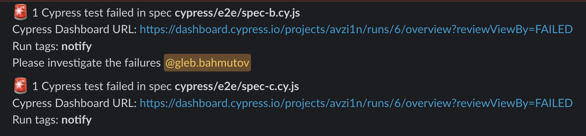
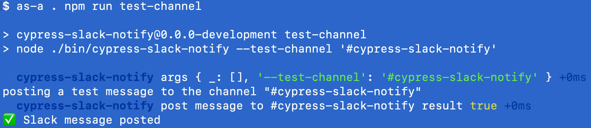

# cypress-slack-notify  [](https://dashboard.cypress.io/projects/avzi1n/runs) [](https://github.com/bahmutov/cypress-slack-notify/actions/workflows/ci.yml)

> Post messages in Slack channels when specific Cypress tests and specs fail



## Install

Add this plugin as a dev dependency

```shell
$ npm i -D cypress-slack-notify
# or add using Yarn
$ yarn add -D cypress-slack-notify
```

Register this plugin from your `cypress.config.js` file (or from your plugins file is using Cypress v9)

```js
// cypress.config.js
const { defineConfig } = require('cypress')

// describe the notification of each failed spec
// you want to notify about
const notificationConfiguration = {
  // if this spec fails, post a message to the channel "e2e-tests"
  'spec-a.cy.js': '#e2e-tests',
  // if this spec fails, post a message and notify Gleb
  'spec-b.cy.js': '#e2e-tests @gleb',
  // if this spec fails, notify several users
  'spec-c.cy.js': '#e2e-tests @gleb @john @mary',
}

// describe when to notify. We probably want to notify
// only when running on CI and recording the test runs
// and using certain run tags
const notifyWhen = {
  whenRecordingOnDashboard: true,
  whenRecordingDashboardTag: ['notify'],
}

module.exports = defineConfig({
  projectId: '...',
  e2e: {
    setupNodeEvents(on, config) {
      // https://github.com/bahmutov/cypress-slack-notify
      require('cypress-slack-notify')(on, notificationConfiguration, notifyWhen)
    },
  },
})
```

### Slack App

To use this plugin, you will need to get yourself a `SLACK_TOKEN` by making a new Slack App. This app needs a bot token with the scope ["chat:write"](https://api.slack.com/scopes/chat:write) to post messages using [`chat.postMessage`](https://api.slack.com/methods/chat.postMessage) method. If you want to tag specific users in the messages, you will need to give the app the permission scope ["users:read"](https://api.slack.com/scopes/users:read) too; it allows the plugin to call [`users.list`](https://api.slack.com/methods/users.list) method to include the user ID in the messages. You will need to invite the registered and installed Slack App to each channel you would like to post messages by this plugin.

You can confirm the Slack application integration by calling:

```
$ SLACK_TOKEN=... npx cypress-slack-notify --test-channel #my-channel-name
```

If the application has been installed correctly, the message will be posted.



## whenISaySo

You can provide your own synchronous predicate function to decide if this plugin should send Slack notifications on failed specs.

```js
const notifyWhen = {
  whenISaySo({ runDashboardUrl, runDashboardTags }) {
    // look at the provided arguments, or any logic like process.env.CI
    // etc to determine if you want to send Slack notifications
    return true | false
  },
}

// https://github.com/bahmutov/cypress-slack-notify
require('cypress-slack-notify')(on, notificationConfiguration, notifyWhen)
```

## Minimatch

You can list spec files by the filename / end of the filepath. You can also rely on [minimatch](https://github.com/isaacs/minimatch) to find the target Slack channel.

```js
const notificationConfiguration = {
  // equivalents
  'spec-a.cy.js': '#one',
  'e2e/spec-a.cy.js': '#one',
  'cypress/e2e/spec-a.cy.js': '#one',
  // use minimatch with spec paths
  // https://github.com/isaacs/minimatch
  // In this case, any failed specs directly in the "sub" folder
  // will post notification to '#cypress-slack-notify-minimatch'
  // https://github.com/isaacs/minimatch
  '**/sub/*.cy.js': '#two',
}
```

In the above situation, any failed test in the spec like `cypress/e2e/sub/home.cy.js` will be posted to `#two`.

## Single channel shortcut

You can post a message about every failed spec into a single channel by using a config shortcut

```js
// cypress.config.js
// https://github.com/bahmutov/cypress-slack-notify
const registerSlackNotify = require('cypress-slack-notify')
...
setupNodeEvents(on, config) {
  // any recorded run tagged "sanity" should notify #sanity-tests channel
  // on each failed spec
  registerSlackNotify(on, '#sanity-tests', {
    whenRecordingDashboardTag: ['sanity'],
  })
})
```

## Effective test tags

If you use [cypress-grep](https://glebbahmutov.com/blog/cypress-grep-filters/) plugin to tag suites or individual tests, you can direct the messages based on the effective test tags.

```js
describe('Login tests', { tags: ['@auth'] }, () => {
  // a failing spec with effective tag "@auth
  it('fails', () => ... )
})
```

```js
// cypress.config.js
// https://github.com/bahmutov/cypress-slack-notify
const registerSlackNotify = require('cypress-slack-notify')

setupNodeEvents(on, config) {
  // any recorded run tagged "sanity" should notify #sanity-tests channel
  // on each failed spec
  registerSlackNotify(on,
    {
      testTags: {
        // list each tag and the Slack target
        '@auth': '#cypress-slack-notify-effective-tags @gleb',
      },
      // only send notifications when recording
      // on Cypress Dashboard with the tag "user"
      {
        whenRecordingDashboardTag: ['user'],
      }
    }
  )
}
```

See [cypress.effective.config.js](./cypress.effective.config.js)

**Tip:** you can define the test tags to Slack targets in a JSON file and load it using a `require` command. For example, if the JSON file below is used `notify.json` we can do:

```json
{
  "@auth": "#auth-tests @gleb",
  "@sell": "#sell-tests @gleb"
}
```

```js
registerSlackNotify(
  on,
  {
    testTags: require('./notify.json'),
  },
  // only send notifications when recording
  // on Cypress Dashboard with the tag "nightly"
  {
    whenRecordingDashboardTag: ['nightly'],
  },
)
```

## Multiple registrations

You can register this plugin multiple times and direct messages based on the recorded Dashboard tags.

```js
// cypress.config.js
// https://github.com/bahmutov/cypress-slack-notify
const registerSlackNotify = require('cypress-slack-notify')
...
setupNodeEvents(on, config) {
  // any recorded run tagged "sanity" should notify #sanity-tests channel
  // on each failed spec
  registerSlackNotify(on, '#sanity-tests', {
    whenRecordingDashboardTag: ['sanity'],
  })
  // any recorded run tagged "user" should notify #user-tests channel
  // on each failed spec
  registerSlackNotify(on, '#user-tests', {
    whenRecordingDashboardTag: ['user'],
  })
})
```

## Find Slack user id

To notify users in the message, this plugin needs to find Slack user ID from the username. You can see the found user by running the `cypress-slack-notify` bin alias

```shell
$ npx cypress-slack-notify --find-user @gleb
found Slack user @gleb ID: U12345678
# use Yarn to call the "bin/cypress-slack-notify.js" script
# You can also skip the "@" at the start of the username
$ yarn cypress-slack-notify --find-user gleb
```

When searching the users, we consider both the property "name" and "profile.display_name" fields.

You can pass multiple usernames separating them with a comma

```shell
$ npx cypress-slack-notify --find-user @gleb,slackbot
found Slack user @gleb ID: U12345678
...
```

If you pass Slack user IDs (they start with `U`), they will simply be returned

```shell
$ npx cypress-slack-notify --find-user @U12345678
already is a Slack user ID U12345678
...
```

## Find a single Slack user by its Slack ID

```shell
$ npx cypress-slack-notify --find-user-by-slack-id U12345678
```

Prints the user's display and real name if found.

## Debugging

Enable verbose log messages by setting an environment variable `DEBUG=cypress-slack-notify`

## Examples

See [bahmutov/cypress-slack-example](https://github.com/bahmutov/cypress-slack-example)

## Small print

Author: Gleb Bahmutov &lt;gleb.bahmutov@gmail.com&gt; &copy; 2022

- [@bahmutov](https://twitter.com/bahmutov)
- [glebbahmutov.com](https://glebbahmutov.com)
- [blog](https://glebbahmutov.com/blog)
- [videos](https://www.youtube.com/glebbahmutov)
- [presentations](https://slides.com/bahmutov)
- [cypress.tips](https://cypress.tips)
- [Cypress Tips & Tricks Newsletter](https://cypresstips.substack.com/)
- [my Cypress courses](https://cypress.tips/courses)

License: MIT - do anything with the code, but don't blame me if it does not work.

Support: if you find any problems with this module, email / tweet /
[open issue](https://github.com/bahmutov/cypress-slack-notify/issues) on Github
